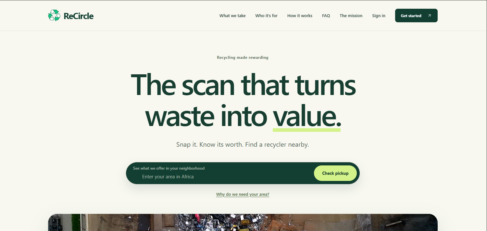
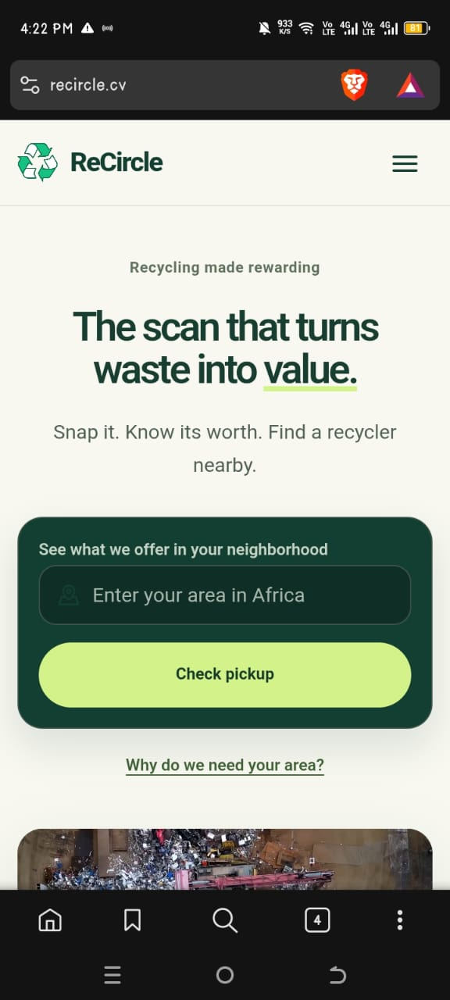
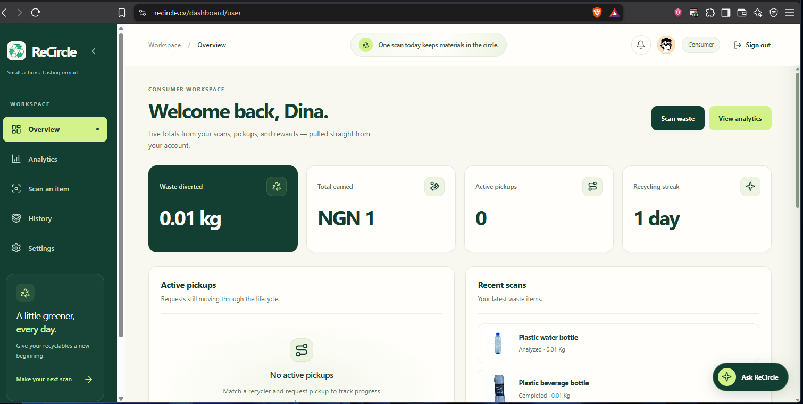
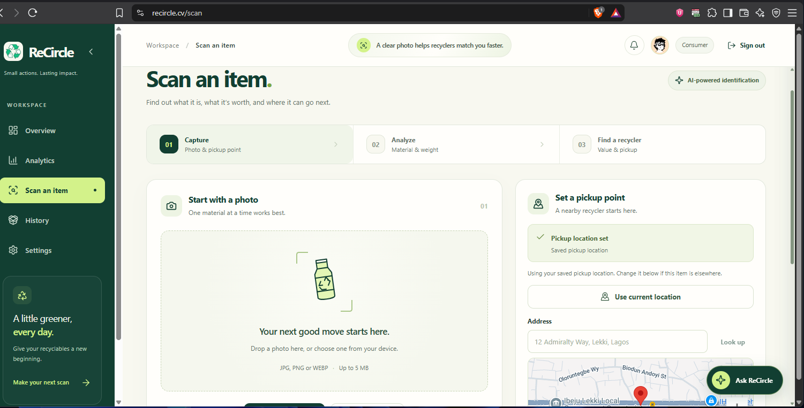
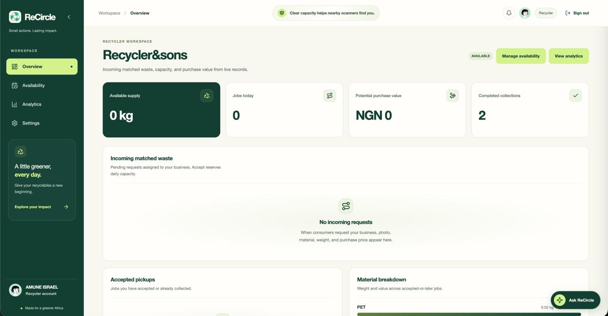
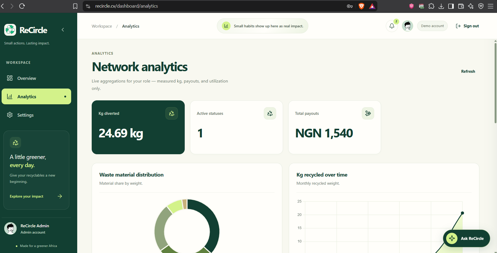

# ReCircle ♻️

ReCircle is an Africa-focused recycling coordination platform that makes recycling more practical, transparent, and rewarding. It helps people identify recyclable materials, estimate their value, find suitable nearby recyclers, and request pickups—all from one streamlined experience.

Built to connect consumers, recycling companies, and platform admins, ReCircle turns the journey from “I have recyclable waste” into a clear, trackable workflow—and gives partner companies a shared channel to discover supply, manage capacity, and complete collections.

## Project Details

| | |
|---|---|
| **Target audience** | Everyday consumers with recyclable waste at home or work; partner recycling companies and collection yards that buy materials and run pickups; and internal admins who oversee the network across cities in Africa. |
| **Demo video** | [ReCircle walkthrough (GIF)](public/demo-video.gif) |

## Screenshots

Drop PNG/JPG files into [`docs/screenshots/`](docs/screenshots/), keep the filenames below (or update the paths), then refresh GitHub to see them in this README.

| Screen | File to add | Preview |
|--------|-------------|---------|
| Landing (desktop) | `docs/screenshots/01-landing-desktop.png` |  |
| Landing (mobile) | `docs/screenshots/02-landing-mobile.png` |  |
| Consumer dashboard | `docs/screenshots/03-consumer-dashboard.png` |  |
| Scan / match recycler | `docs/screenshots/04-scan-match.png` |  |
| Recycler incoming pickups | `docs/screenshots/05-recycler-dashboard.png` |  |
| Wallet / top-up / withdraw | `docs/screenshots/06-payout-wallet.png` |  |
| Admin / analytics | `docs/screenshots/07-admin-analytics.png` |  |
| Settings withdrawal bank | `docs/screenshots/08-settings-payout.png` |  |

**How to attach screenshots**

1. Capture the UI (desktop ~1280px wide; mobile ~390px wide works well).
2. Save into `docs/screenshots/` using the names in the table (or rename and edit the image paths above).
3. Commit the images with the README so GitHub renders them.

Until a file exists, GitHub may show a broken-image icon for that row—that is expected.

## Inspiration 🧠

Recycling often breaks down before it begins: people may not know whether an item is recyclable, how to prepare it, what it is worth, or where to take it. Meanwhile, recycling companies need a reliable way to discover available materials, coordinate pickups, and manage daily capacity—often without a shared system that works across partners.

ReCircle was created to close that gap. The goal was to build a digital bridge between households and recycling companies, with admins overseeing the network—making recycling easier to participate in while helping valuable materials stay out of landfills.

## What it does ❔

ReCircle supports three key roles:

- **Consumers** can scan or upload waste images, receive AI-assisted material identification, review preparation guidance, estimate waste value, compare nearby recyclers, and request pickups.
- **Recyclers** (partner recycling companies) can manage their service areas, accepted materials, pricing rules, collection capacity, and incoming pickup requests.
- **Admins** can monitor platform activity, track pickup progress, review recycler utilization, and plan more efficient collection batches across the network.

The platform is designed for **partnership with recycling companies and collection networks**: each partner runs their own operations on ReCircle, while consumers get one place to match, request, and track pickups.

The platform follows the full recycling journey:

`Scan waste → Analyze material → Add weight → Match recycler → Request pickup → Accept (funds locked) → Collect → Complete (wallet credited) → Withdraw to bank (optional)`

## Key features ✨

- AI-assisted waste classification with confidence scores and safety/preparation guidance
- Consumer confirmation and correction when AI confidence is low
- Location-aware recycler matching based on distance, pricing, accepted materials, service radius, and available capacity
- Transparent estimated recycling value in local currency (NGN), including fractional amounts (for example `NGN 1.08`)
- Double-wallet escrow: recyclers prepay, accept locks funds, complete credits the consumer wallet, withdraw sends money to bank
- Pickup request lifecycle with clear statuses from pending to completed
- Role-based dashboards for consumers, recyclers, and admins
- Partnership-ready recycler profiles so companies can publish materials, pricing, and capacity in one place
- Collection-batch suggestions to help admins organize pickups efficiently across partner zones
- Analytics for materials, collections, payouts, recycler capacity, and pickup activity
- A grounded AI assistant that answers questions using available ReCircle data without inventing prices, earnings, pickup statuses, or distances
- Secure authentication through Google sign-in or email OTP verification
- Request-scoped chat between consumers and recyclers during an active pickup
- Mobile-responsive marketing pages, auth/onboarding, scan workspace, and role dashboards (breakpoints at 480 / 768 / 1024)

## How we built it 🖥️

ReCircle is built with **Nuxt 4**, **Vue 3**, **TypeScript**, and **Tailwind CSS 4** for a fast, responsive frontend experience. Layout responsiveness uses custom CSS (Flexbox/Grid, fluid `clamp` tokens, and shared breakpoints) on top of the Tailwind entry.

The backend uses **Nuxt server APIs**, **MongoDB**, and **Mongoose** to manage users, recyclers, waste items, pickup requests, wallet ledgers, notifications, and analytics. MongoDB’s GeoJSON and geospatial indexing power nearby recycler discovery and location-based matching.

We also integrated **OpenRouter** for structured waste-image analysis, **Byteship** for secure uploads, **Google Maps** for pickup-location selection and geocoding, **Google OAuth** and **Resend OTP** for authentication, **Paystack** for recycler top-up Checkout and consumer withdraw Transfers, **Chart.js** for analytics, and **Zod** for API validation.

## Implementation highlights

Recent product and platform work shipped in this codebase:

### Responsive UI (landing → dashboards)

- Shared fluid design tokens (`--text-*`, `--space-*`, `--tap-min`) and unified breakpoints at **≤480 / ≤768 / ≤1024**
- Marketing hamburger nav, dashboard off-canvas sidebar, scan workspace grids that stack on smaller screens
- Touch-friendly tap targets, footer links, auth/onboarding density fixes, and icon-only AI FAB / sign-out on narrow viewports

### Matching, pickups, and collaboration

- Deterministic recycler ranking (distance, price, capacity, service radius)
- Eligible recyclers listed even outside radius (flagged), with consumer reassign while pending
- Pickup lifecycle with strict status transitions; recycler **Confirm collected** settles locked wallet funds
- Request-scoped chat for consumers and recyclers on active pickups
- Notifications and paginated history / list surfaces for operational volume

### Rewards, wallet, and Paystack

- **Double wallet:** recyclers top up available balance; consumers earn into their wallet on complete
- On **accept**, ReCircle locks `weightKg × pricePerKg` from the recycler (available → reserved)
- On **complete**, reserved funds settle into the consumer wallet (no bank Transfer per pickup)
- Consumers withdraw on demand via **Paystack Transfer** to a saved NUBAN in Settings
- Recycler top-ups use Paystack Checkout; wallet credit only after a verified webhook (or demo top-up when TEST keys are unset)
- ReCircle is the **ledger + Paystack rails**, not the payer of rewards — recyclers fund the system

## Challenges we ran into 🏃

One of the biggest challenges was making AI useful without allowing it to become unreliable. Instead of trusting AI output blindly, ReCircle validates every response against a strict schema, applies confidence thresholds, and lets users correct uncertain classifications.

Recycler matching was another complex area. A nearby recycler is not automatically the best recycler, so the platform evaluates distance, material acceptance, service radius, pricing, and remaining capacity before making a recommendation.

We also had to design role-specific workflows that remain connected: consumers need a simple recycling experience, partner recycling companies need operational clarity, and admins need network oversight without being able to alter restricted pickup actions.

Settlement is wallet-first: recyclers prepay, accept locks escrow, complete credits the consumer, and bank payouts happen only on explicit withdraw. ReCircle is the ledger and Paystack rails — not the payer of rewards.

## Accomplishments we’re proud of 🚀

We are especially proud of building more than a recycling directory. ReCircle supports the actual operational flow behind recycling—from waste discovery to matching, pickup tracking, and completion.

- A deterministic recycler-ranking system rather than AI-generated recommendations
- Secure, scoped image uploads
- Strict pickup status transitions that prevent invalid workflow changes
- Capacity-aware recycler recommendations
- Mobile-responsive dashboards for every user role
- Analytics built from real platform data instead of misleading environmental estimates
- An AI assistant designed to stay grounded in verified platform data
- Double-wallet escrow settlement with Paystack top-up and on-demand withdraw

## What we learned 📖

Building ReCircle strengthened our understanding of full-stack product development, especially role-based access control, geospatial queries, secure authentication, AI integration, and operational workflow design.

We also learned that responsible AI requires boundaries. By combining AI analysis with validation, user confirmation, and deterministic business logic, we created a more trustworthy experience than relying on generated answers alone.

Most importantly, ReCircle showed us how technology can make sustainable actions feel simpler, more accessible, and more connected to real-world impact.

---

## Technical documentation

## Local setup

Use Node.js 24 LTS and npm.

1. Run `npm install` (use `npm.cmd` in PowerShell if script execution is disabled).
2. Copy `.env.example` to `.env`.
3. Set `MONGODB_URI` to your MongoDB Atlas URI. Configure an Atlas database user and
   network access for your machine. Never paste credentials into commits or logs.
4. Generate `SESSION_SECRET` locally:
   `node -e "console.log(require('node:crypto').randomBytes(32).toString('hex'))"`.
5. Run `npm run dev` and open http://localhost:3000.

The scanner needs `BYTESHIP_API_KEY`; analysis needs `OPENROUTER_API_KEY` and a
vision model in `OPENROUTER_MODEL` that supports strict structured output.
Payment keys may remain empty.
Set `SESSION_SECRET` to at least 32 random characters before using authentication.

### Wallet settlement (escrow flow)

ReCircle never funds consumer rewards and never settles cash on collection. Money moves
**recycler → consumer** on the platform, then **consumer → bank** only when they withdraw.

#### Roles of money

| Wallet | Who | Purpose |
|--------|-----|---------|
| **Recycler wallet** | Partner yard | Prepay so they can accept pickups; funds are locked then paid out |
| **Consumer wallet** | Household user | Receives rewards on collection; withdraws to bank when ready |

| Balance | Meaning |
|---------|---------|
| Recycler `available` | Can be used to accept new pickups |
| Recycler `reserved` | Locked for accepted-but-not-completed requests |
| Consumer `available` | Earned, withdrawable |

#### End-to-end flow

```text
1. Recycler tops up wallet     Paystack Checkout → webhook credits available
2. Consumer requests pickup    pending — no money moved
3. Recycler accepts            LOCK: available → reserved (lockedPayout = weightKg × pricePerKg)
4. Recycler completes          SETTLE: debit reserved → credit consumer available
5. Consumer withdraws          available → Paystack Transfer → NUBAN (optional)
```

Reject or cancel after accept → **UNLOCK** (reserved → available). Nothing hits the consumer.

**v1 rule:** complete pays exactly `lockedPayout`. Reweigh / adjust is out of scope for now.
Pickup **completed** means **settled in-app**, not “bank transfer succeeded.”

#### Lifecycle vs money

| Request status | Money |
|----------------|--------|
| `pending` | None |
| `accepted` | Recycler: `lockedPayout` reserved |
| `picked_up` | Still reserved (collection in progress) |
| `completed` | Reserved debited; consumer wallet credited |
| `rejected` / `cancelled` (after accept) | Reserved returned to recycler available |

#### Bank rails (Paystack)

| Flow | Behaviour |
|------|-----------|
| Recycler top-up | Paystack Checkout (`/transaction/initialize`). Wallet credited **only** after verified `charge.success` webhook — never from a client “I paid” claim. When TEST keys are unset, `POST /api/wallet/top-up/demo` credits immediately for local demos. |
| Consumer withdraw | Debits wallet and initiates Paystack Transfer to the saved NUBAN. Clear 4xx rejections restore balance; unclear timeouts stay pending for webhook. Without Paystack keys, withdraw debits locally (demo). |
| On complete | **Not used.** No per-pickup Transfer to bank. |

#### What the UI should say

- **Recycler:** wallet available / reserved / top up; on accept “₦X will be locked”; cannot accept without enough balance; complete = “Confirm collected”
- **Consumer:** wallet balance + history; on accept “₦X locked for your pickup”; on complete “₦X added to your wallet”; Settings = bank for withdrawals
- **Admin:** balances, failed top-ups/withdrawals, reserved totals — audit visibility only

#### Invariants

1. Only recyclers fund the system (via top-up).
2. Accept always locks full `lockedPayout` or fails.
3. Complete moves value once, idempotently (no double credit).
4. Cancel/reject after accept always unlocks.
5. Consumer bank payout only via explicit withdraw.
6. Server ledger is source of truth; UI never invents balances.
7. No cash settlement method.

#### Try it locally

1. Add Paystack **TEST** keys to `.env` (live keys are rejected), or leave them empty for demo top-up / demo withdraw.
2. Recycler: top up wallet from the recycler dashboard.
3. Accept and complete a pickup — consumer wallet increases (no bank Transfer yet).
4. Consumer: save NUBAN in **Settings → Withdrawal bank account**, then withdraw from the dashboard.

Estimated / locked payouts use `weightKg × pricePerKg` (two decimal places).

## Commands

- `npm run dev`: development server
- `npm run lint`: ESLint
- `npm run typecheck`: strict Nuxt/Vue TypeScript checks
- `npm test`: password, model, classification, matching, lifecycle, dashboard and assistant helper checks
- `npm run build`: production build
- `npm run seed`: insert labelled demo data and verify MongoDB indexes
- `npm run test:auth`: HTTP auth checks against a running dev server on port 3001
- `npm run test:upload`: live Byteship upload and draft check against port 3001
- `npm run test:analysis`: live upload, OpenRouter classification, auth, cache and correction check against port 3001
- `npm run preview`: local production preview

## Structure

Nuxt 4 frontend directories live under `app/`; do not add duplicate root pages or components.

```text
app/
  pages/          Landing, accounts, role pages, scanner, analysis, valuation and requests
  layouts/        Public and dashboard shells
  components/     Brand, navigation, Button, Card, Badge, Modal,
                  EmptyState, LoadingSkeleton, StatCard, StatusTimeline, RequestCard,
                  DashboardMetrics, IncomingRequestCard, BreakdownList, CapacityMeter,
                  AnalyticsChart, AiAssistantDrawer
  composables/    Auth, scanner upload, pickup location, chart and health state
  middleware/     Role-aware navigation guards
  assets/css/     Tailwind entry, design tokens and responsive styles
server/
  api/            HTTP endpoints (wallet top-up/withdraw/ledger, Paystack webhook, …)
  middleware/     Response headers
  models/         Mongoose models (User, Recycler, Request, LedgerEntry, TopUp, Withdrawal, …)
  services/       Auth, classification, matching, pickup requests, ledger escrow,
                  wallet + Paystack rails, analytics, assistant context
  utils/          Configuration, database, sessions, validation
scripts/           Demo seed and live HTTP verification
docs/screenshots/  README screenshots (add PNGs here)
types/            Shared contracts; never put secrets here
utils/            Pure formatting, classification, matching, lifecycle and assistant utilities
tests/            Password, model, classification, matching, lifecycle and assistant tests
```

Frontend components own presentation only. Request bodies use Zod through
`readValidatedJson`. Protected endpoints use server authorization; client
middleware is not an authorization boundary.


Documentation:
[Nuxt](https://nuxt.com/docs/4.x),
[Mongoose](https://mongoosejs.com/docs/connections.html),
[H3 sessions](https://h3.dev/examples/handle-session),
[Byteship](https://byteship.dev/docs/uploading-a-file),
[OpenRouter](https://openrouter.ai/docs/quickstart),
[Chart.js](https://www.chartjs.org/docs/latest/getting-started/integration.html),
[Paystack](https://paystack.com/docs/),
[Paystack Transfers](https://paystack.com/docs/transfers/).
